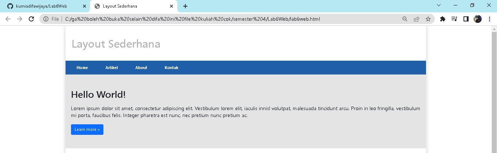
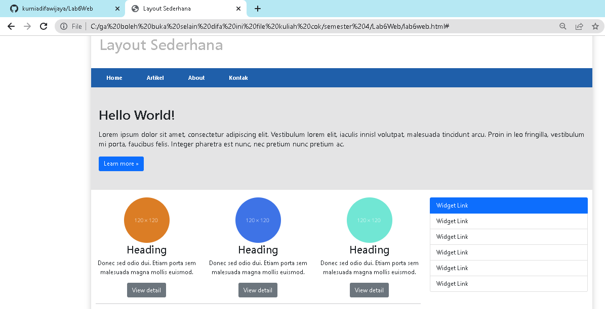
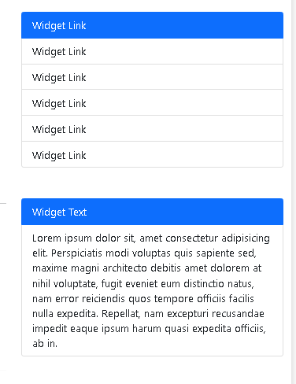
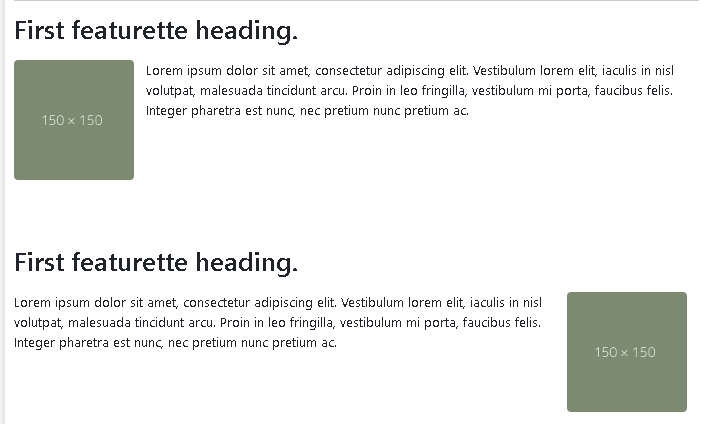
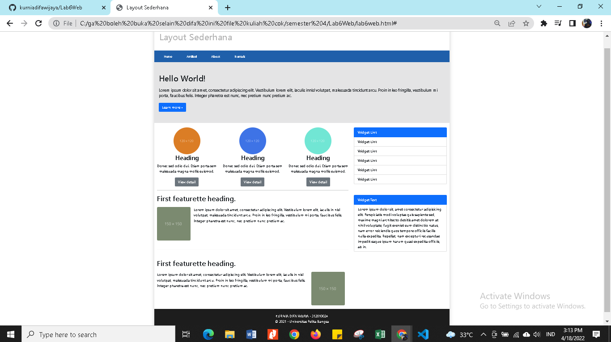

# Lab6Web

**nama : kurnia difa wijaya**

**no induk : 312010024**

**kelas : TI 20 B 01**

pada pertemuan kali ini kita akan membuat layout sederhana 

* **MEMBUAT HEADER DAN HERO**

pertama saya akan membuat halaman baru dengan nama index.html dimana didalam file tersebut sudah saya masukkan file Bootstrap dan Javascript yang ada.

* **MEMBUAT 2 KOLOM BERISI HEADING DAN WIDGET HEADERS**

kemudian saya akan membuat baris baru menggunakan <div=class="row"> menjadi 2 bagian. yang sisi kiri 8 kolom dan sisi kanan 4 kolom 

*

* **MEMBUAT WIDGET LAYOUT**

kemudian membuat Widget Layout yang ada di sisi sebelah kanan. Source code yang saya tambahkan adalah seperti berikut

* **MEMBUAT KONTEN ARTIKEL**

langkah selanjutnya membuat content article menggunakan bootstrap. dimana setiap artikel yang ditambahkan akan ada foto di sisi kiri dan kanan. Saya akan menambahkan beberapa source code untuk content article

* **MENAMBAHKAN FOOTER**

kemudian menambahkan footer menggunakan Bootstrap. Source code yang saya gunakan untuk membuat footer adalah sebagai berikut

* **HASIL WEBSITE**

